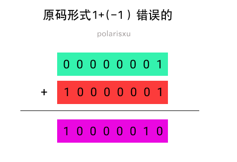
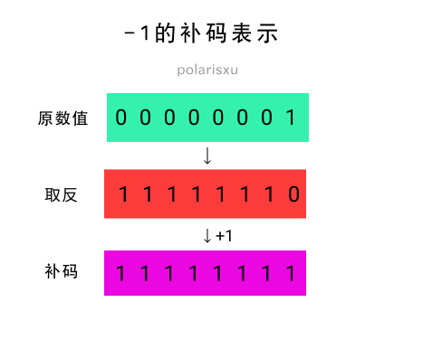
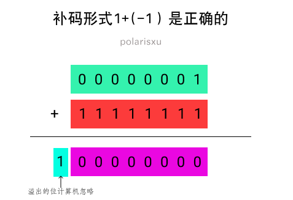

# Go每日一题

> 今日（2023-02-09）的题目如下

今天给两道类似的题目，注意，有半数以上的人可能会做错！

### 题一

```golang
package main

func main() {
    var a int8 = -1
    var b int8 = -128 / a

    println(b)
}
```

### 题二

```golang
package main

func main() {
    const a int8 = -1
    var b int8 = -128 / a

    println(b)
}
```

它们分别输出什么？请写出你的答案，能解释原因最好。


<details>
<summary style="cursor: pointer">🔑 答案解析：</summary>
<div>

这是站长在去年双节期间公众号「polarisxu」上发布的题目。

答对的人真不多（半数以上答错了），特别是题一，一半以上竟然是 128，难道不知道 int8 能表示的范围吗？[-128, 127]。不过为什么答案是：题一 -128，题二编译错误？

其实这是一道计算机基础题。

先看看网友 Jayce 的解释：第一题是 -128（untyped const）/ -1 (int8 var)，untyped 隐式转换为 int8，刚好在范围内，结果是 128 ，溢出 int8 的范围。因为结果不是常量，允许溢出，最高位为符号位，变成了补码，刚好又是 -128。 第二题 -128 和 -1 都是 const，直接在编译时求值，untyped 的 -128 隐式转 int8，结果为 128，仍然是一个 const。const 转换时不允许溢出，编译错误。 其实差别就是表达式的值，题一不是常量题二是，常量类型转换不允许溢出后 truncate。

### 关于补码

如果你忘了补码（`Two's Complement`，2 的补码，一般直接称为补码），这里简单做个说明。

先问一个问题：在计算机内部 -1 二进制表示是什么（假如为 int8）？

我们很容易这么想：1 的二进制是 00000001，而最高位是符号位，因此 -1 是 10000001。因为 1 + (-1) = 0，但 00000001 + 10000001 = 10000010，很显然，这个结果不是 0。这是原码表示。



所以，计算机内部采用补码（Two's Complement）表示负数。补码怎么得到呢？一般分两步：



第一步，每一个二进制位都取相反值，0 变成 1，1 变成 0。比如，00000001 的相反值就是 11111110。

第二步，将上一步得到的值加 1。11111110 就变成 11111111。



关于原码、反码和补码，可以看这篇文章：[https://www.cnblogs.com/zhangziqiu/archive/2011/03/30/ComputerCode.html](https://www.cnblogs.com/zhangziqiu/archive/2011/03/30/ComputerCode.html)，很详细。

### 题解

#### 先看题一

因为 `var b int8 = -128 / a` 不是常量表达式，因此 untyped 常量 -128 隐式转换为 int8 类型（即和 a 的类型一致），所以 `-128 / a` 的结果是 int8 类型，值是 128，超出了 int8 的范围。因为结果不是常量，允许溢出，128 的二进制表示是 10000000，正好是 -128 的补码。所以，第一题的结果是 -128。

> 关于整数溢出的 Go 语言规范说明：[https://hao.studygolang.com/golang_spec.html#id158](https://hao.studygolang.com/golang_spec.html#id158)。

在 Go 语言规范中关于整数运算有这样的说明：[https://hao.studygolang.com/golang_spec.html#id327](https://hao.studygolang.com/golang_spec.html#id327)

> 对于两个整数值 x 和 y ，其整数商 q = x / y 和余数 r = x % y 满足如下关系：
>
> x = q*y + r 且 |r| < |y|
>
> 这个规则有一个例外，如果对于 x 的整数类型来说，被除数 x 是该类型中最负的那个值，那么，因为 补码 的 整数溢出 ，商 q = x / -1 等于 x （并且 r = 0 ）。

所以例外情况有：

类型 | x, q 的值
-- | --
int8 | -128
int16 | -32768
int32 | -2147483648
int64 | -9223372036854775808

#### 再看题二

对于 `var b int8 = -128 / a`，因为 a 是 int8 类型常量，所以 `-128 / a` 是常量表达式，在编译器计算，结果必然也是常量。因为 a 的类型是 int8，因此 -128 也会隐式转为 int8 类型，128 这个结果超过了 int8 的范围，但常量不允许溢出，因此编译报错。

### 总结
这题并非 Go 独有，而是计算机的基础。比如相应的 C 语言程序，结果和 Go 对应程序是一样的。

```c
// 对应题一
#include <stdio.h>

int main() {
        char a = -1;
        char b = -128 / a;

        printf("%d\n", b);

        return 0;
}
```

结果 -128。

```c
// 对应题二
#include <stdio.h>

int main() {
        const char a = -1;
        char b = -128 / a;

        printf("%d\n", b);

        return 0;
}
```

编译报错。

答案解析来自：[https://polarisxu.studygolang.com/posts/basic/complement/](https://polarisxu.studygolang.com/posts/basic/complement/)。


---

### 16楼

原码、反码、补码----被搞晕了。 -1 1000 0001 【原码】 -1 1111 1110 反码 -1 1111 1111 补码=反码+1

</div>
</details>