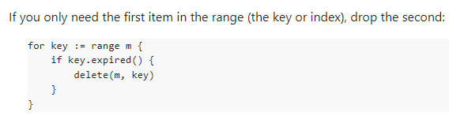
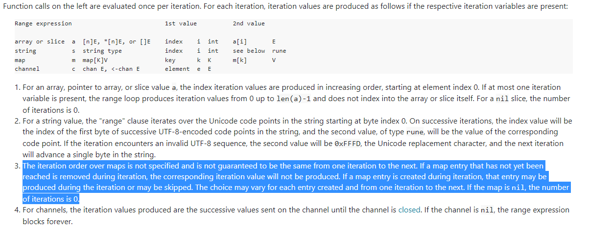

# Go 每日一题

> 今日（2023-08-23）的题目如下

Go 的 map 可以边遍历边删除吗？

<details>
<summary style="cursor: pointer">🔑 答案解析：</summary>
<div>

map 并不是一个线程安全的数据结构。同时读写一个 map 是未定义的行为，如果被检测到，会直接 panic。

上面说的是发生在多个协程同时读写同一个 map 的情况下。 如果在同一个协程内边遍历边删除，并不会检测到同时读写，理论上是可以这样做的。但是，遍历的结果就可能不会是相同的了，有可能结果遍历结果集中包含了删除的 key，也有可能不包含，这取决于删除 key 的时间：是在遍历到 key 所在的 bucket 时刻前或者后。

一般而言，这可以通过读写锁来解决：sync.RWMutex。

读之前调用 RLock() 函数，读完之后调用 RUnlock() 函数解锁；写之前调用 Lock() 函数，写完之后，调用 Unlock() 解锁。

另外，sync.Map 是线程安全的 map，也可以使用。

参考答案来自：[https://golang.design/go-questions/map/delete-on-range/](https://golang.design/go-questions/map/delete-on-range/)

---

### 1 楼

清空 map， :smile:

```golang
for k := range m {
    delete(m, k)
}
```

### 12 楼

```golang
// Go1.11版本以上这种清空map方法有效
for k := range mapdemo {
    delete(mapdemo , k)
}
```

### 15 楼

@Dessert</a> 我记得有一期的每日一题研究过 `range` 遍历，map 的遍历是实时的，在遍历第 1 个元素时删除第 2 个元素，那么后续就不会遍历第 2 个元素。遍历第 1 个元素时删除第 1 个元素，后续更不会再出现第 1 个元素了。

[https://go.dev/doc/effective_go#for](https://go.dev/doc/effective_go#for) ， 这个官方例子也展示了可以在遍历的时候删除。



[https://go.dev/ref/spec#For_statements](https://go.dev/ref/spec#For_statements) ， 同时官方的 range 迭代也有说着遍历时删除和新增的情况



我感觉清空 map 还是直接用 `m=make(map[string]string)` 生成新对象，让 GC 清理旧 map 好点，因为 map 的 delete 并不会真的删除里面元素，貌似只是标记被删除，这个比较底层没深入研究，这时还是会占用一些内存吧。

### 19 楼

多个协程同时读写同一个 map，会得到如下的 panic 噢

> fatal error: concurrent map iteration and map write

多协程下可以使用 Go1.9 版本引入的 sync.Map 类型来替换 map

💡Tips：多协程读 map 是没问题的，但是写不行

</div>
</details>
