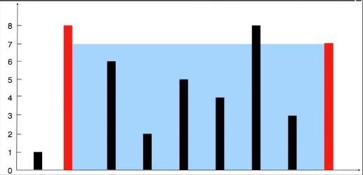

# 2024-01-03 练习题

> 来源 : [Python 每日一练-LeetCode-数组练习-最大容积计算](https://www.bilibili.com/video/BV1EC4y1S7cq/)

## 题目说明

> - 给定一个长度为 n 的整数数组 height。有 n 条垂线，第 i 条线的两个端点是 (i, 0) 和 (i, height[i])。
> - 找出其中的两条线，使得它们与 x 轴共同构成的容器可以容纳最多的水。
> - 返回容器可以储存的最大水量。
>
> - 说明: 你不能倾斜容器。
>
> 例如:
>
> - 输入: [1, 8, 6, 2, 5, 4, 8, 3, 7]
> - 输出: 49
>
> 输入: height = [1, 1]
> 输出: 1

## 说明



- 输入: [1, 8, 6, 2, 5, 4, 8, 3, 7]
- 输出: 49

> 解释：图中垂直线代表输入数组 [1, 8, 6, 2, 5, 4, 8, 3, 7]。
> 在此情况下，容器能够容纳水 (表示为蓝色部分)的最大值为 49。

<details>
<summary style="cursor: pointer">🔑 参考：</summary>
<div>

## 分析

1. 在初始时，左右指针分别指向数组的左右两端，它们可以容纳的水量为 `min(1, 7)*8 = 8`。
2. 此时我们需要移动一个指针。
3. 移动哪一个呢？
4. 应该移动对应数字较小的那个指针（即此时的左指针）
5. 这是因为，由于容纳的水量是由
6. 两个指针指向的数字中 `较小值 * 指针之间的距离` 两个指针指向的数字中 `较小值 * 指针之间的距离`
7. 两个指针指向的数字中`较小值 * 指针之间的距离`决定的。

## 参考代码

### Golang 代码实现

```golang
import "fmt"
// 入口
func main() {
	heights := []int{2, 7, 4, 1, 8, 1}
	fmt.Println("初始数据", heights)

	solution(heights)
}

func min(a, b int) int {
	if a < b {
		return a
	}
	return b
}

// 解决方案
func solution(heights []int) {
	left, right := 0, len(heights)-1
	max_vol := 0
	for left < right {
		vol := min(heights[left], heights[right]) * (right - left)
		if vol > max_vol {
			max_vol = vol
		}
		if heights[left] < heights[right] {
			left++
		} else {
			right--
		}
	}
	fmt.Println("最大容量", max_vol)
}
```

### Python 代码实现

```python
# 左右指针, 更新最大容积,移动较短的那根指针
heights = [1, 8, 6, 2, 5, 4, 8, 3, 7]
Left, right = 0, len(heights)-1
maxl = 0

while left<right:
	currentl = min(heights[left], heights[right])*(right-left)
	maxl = max(maxl, currentl)

	if heights[left]<heights[right]:
		left +=1
	else:
		right -= 1
print(f"所能组成最大容积为{maxL}")
```

</div>
</details>
